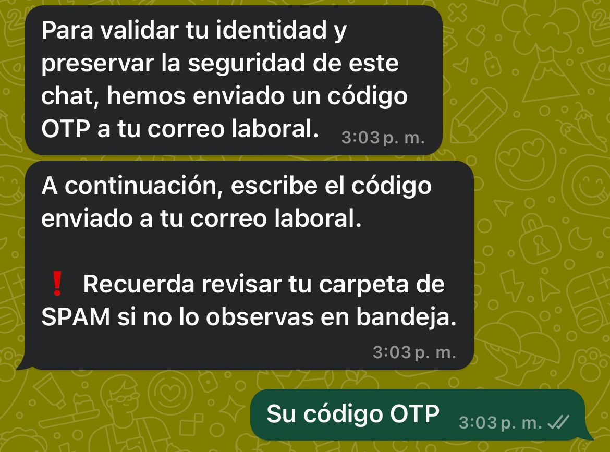
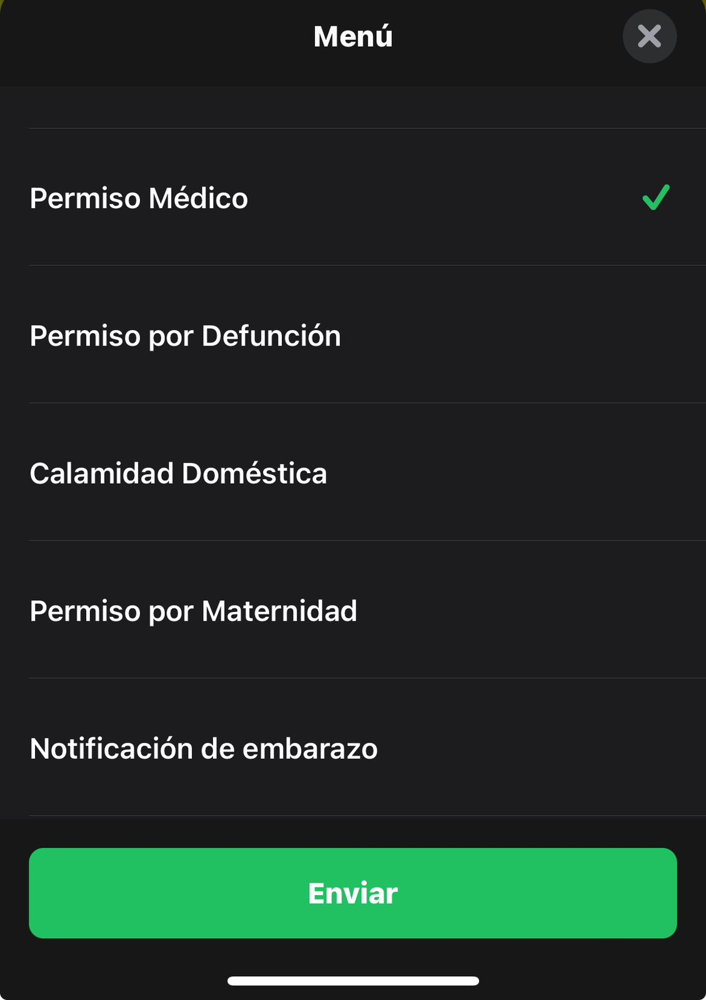
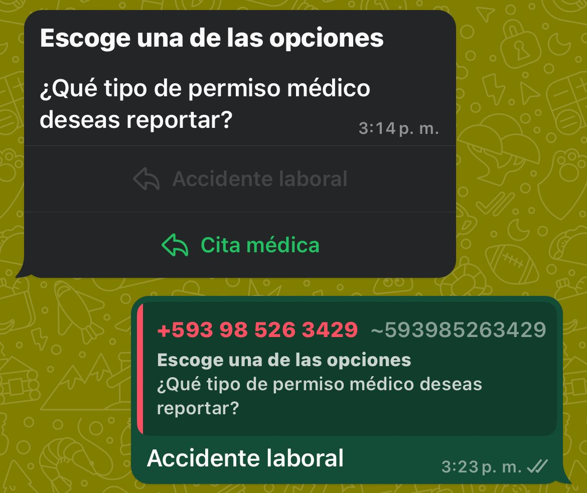

<!DOCTYPE html>
<html lang="es">
<head>
    
</head>
</html>

    <h1 style="font-size: 30px; color: #FFD750; margin: 0;"> ¿Cómo Reportar un Accidente Laboral?</h1>
    

     
<h1 style="font-size: 24px; color: #FFD700; margin: 0;">En este documento:</h1>     

<strong>Paso 1:</strong> [¡Hable con Porito!](#porito).

<strong>Paso 2:</strong> [Autenticación](#auten).

<strong>Paso 3:</strong> [Reportar un Accidente Laboral](#reporte).

     
<h1 style="font-size: 24px; color: #FFD700; margin: 0;">¿No sabe como reportarlo? ¡Hable con Porito!</h1> 

¡No se preocupe si no sabe cómo reportar un accidente! En <strong>Grupo Porito</strong>, entendemos que la tecnología puede ser complicada a veces. Por eso, hemos hecho que este proceso sea sencillo. Ahora puede hacerlo a través de WhatsApp, donde nuestro bot <strong>Porito</strong> le guiará paso a paso para que pueda gestionar su reporte sin complicaciones. Para hablar con Porito puede [conectarse directamente con el link](#link) o [agregar a Porito a Whatsapp](#manual).

     
<h1 style="font-size: 24px; color: #FFD700; margin: 0;">Conectarse directamente con el link</h1> 

+ En su dispositivo móvil, abra su navegador de preferencia.
+ En la barra de búsqueda, ingresa el link del bot: <strong>wa.me/593985263429</strong>  y pulse *Enter*.
+ En su pantalla verá una burbuja con el mensaje: *¿Abrir esta página en "WhatsApp"?* .
+ Pulse *Abrir*.
+ Se abrirá WhatsApp en su dispositivo.
+ Escriba las palabras <strong>Recursos Humanos</strong>.

     
<h1 style="font-size: 24px; color: #FFD700; margin: 0;">Agregar a Porito a Whatsapp</h1> 

- Abra WhatsApp en su dispositivo.
- En la parte superior derecha, encontrará el ícono <strong>+</strong>.
- Pulse la opción *Nuevo Contacto*.
- En el apartado de *Teléfono*, seleccionar como pais <strong>Ecuador</strong>.
- Ingrese el número <strong>985263429</strong>.
- Pulse *Guardar*.
- Busque el contacto y escriba las palabras <strong>Recursos Humanos</strong>.

     
<h1 style="font-size: 24px; color: #FFD700; margin: 0;">Autenticación</h1> 

Para empezar, asegúrese de tener a mano:

> <strong>Cédula:</strong> Documento de identidad emitido a los ciudadanos de un país. Es personal e intransferible.
>
> <strong>Código OTP:</strong> Código de 6 dígitos que recibirá en su correo corporativo.

Al abrir el chat con <strong>Porito</strong>, se le solicitará primeramente su número de cédula.

Posteriormente, será necesario ingresar su código OTP.

     
<h1 style="font-size: 24px; color: #FFD700; margin: 0;">Reporte un Accidente Laboral</h1> 

Después de completar el proceso de autenticación, se abrirá el asistente virtual. Pulse *Menú* y, a continuación, selecciona la opción <strong>Permiso Médico</strong>. Luego, pulse *Enviar*.

    
    

Finalmente, pulse la opción <strong>Accidente laboral</strong>, para seleccionar el tipo de reporte.

Ahora, para poder realizar el reporte del *Accidente Laboral*, lo primero que hay que identificar es el <strong>lugar donde ocurrió el accidente</strong>:

- Dentro del trabajo.
- Fuera del trabajo.

Según el <strong>perfil</strong>  se podrá hacer el reporte:

- [Si es colaborador](#soy-colaborador).
- [Si es Familiar](#soy-familiar).

     
<h1 style="font-size: 24px; color: #FFD700; margin: 0;">¡Soy Colaborador!</h1> 

Si su accidente ocurrió dentro del trabajo:

- Indicar la <strong>sede del trabajo</strong> donde ocurrió el accidente.
- Describir el <strong>lugar especifico donde ocurrió el accidente</strong> dentro de la sede.
- Indicar la <strong>fecha y hora</strong> del accidente.
- Indicar el <strong>nombre del gerente</strong> en el momento del accidente.
- Enviar una <strong>foto de la lesión</strong>.
- Proporcionar una <strong>descripción breve del accidente</strong>.

Si su accidente ocurrió fuera del trabajo:

- Especificar <strong>por qué razón se encontraba fuera de las instalaciones</strong>.
- Especificar <strong>que medio de transporte usaba  para transportarse</strong>.
- Indicar la <strong>sede del trabajo</strong> donde ocurrió el accidente.
- Describir el <strong>lugar especifico donde ocurrió el accidente</strong> dentro de la sede.
- Indicar la <strong>fecha y hora</strong> del accidente.
- Indicar el <strong>nombre del gerente</strong> en el momento del accidente.
- Enviar una <strong>foto de la lesión</strong>.
- Proporcionar una <strong>descripción breve del accidente</strong>.

     
<h1 style="font-size: 24px; color: #FFD700; margin: 0;">¡Soy Familiar!</h1> 

- <strong>Nombre completo</strong>.
- <strong>Parentesco</strong> (ejemplo: padre, madre, hermano/a, pareja, otro).
- <strong>Número de teléfono</strong>.
- Describir el <strong>lugar especifico donde ocurrió el accidente</strong> dentro de la sede.
- Indicar la <strong>fecha y hora</strong> del accidente.
- Indicar el <strong>nombre del gerente</strong> en el momento del accidente.
- Enviar una <strong>foto de la lesión</strong>.
- Proporcionar una <strong>descripción breve del accidente</strong>.

------

><strong>Nota:</strong> Debe recibir el retorno de este reporte en un rango de 24 a 48 horas.

> <strong>Importante:</strong>  Si no ha recibido una confirmación en 48 horas, comuniquese directamente con Recursos Humanos al *teléfono de extensión 108*. 

