# How to Create a Board in a Specific Channel

| STEP |                         DESCRIPTION                          |
| :--: | :----------------------------------------------------------: |
|  1   | Go to the left sided menu bar and select the specific channel to create a board.  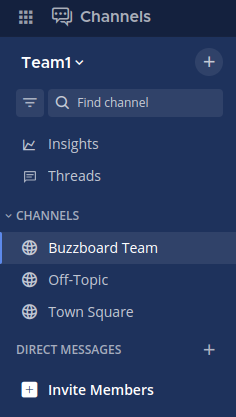 |
|  2   | Once you click the channel, you will enter on it. 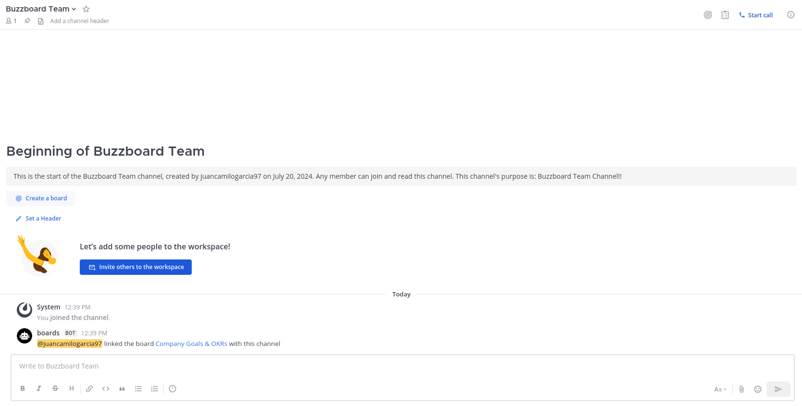 |
|  3   | Click on **Create a board** to create one. 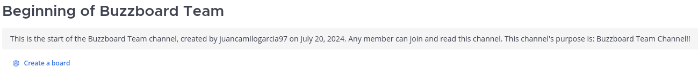 |
|  4   | You can select one board template or a create a new blank one.  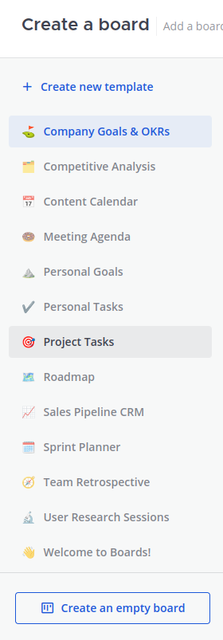 |
|  5   | Name the board and click on the **New** button in the **No Status section**. 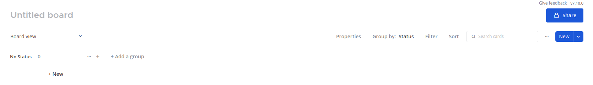 |
|  6   |  Edit the **Task** as you need. 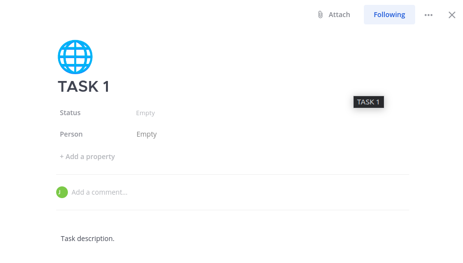   |
|  7   |                     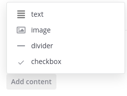                     |
|  8   | You can also attach files, once its ready you can **Close this dialog.** 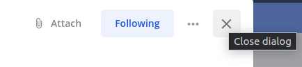 |
|  9   |   You can see the task created.  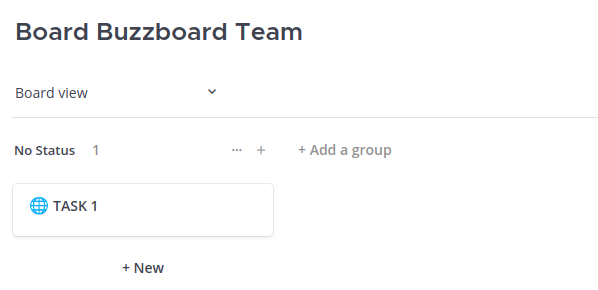   |
|  10  | You can also create a group clicking on the **+New** button. 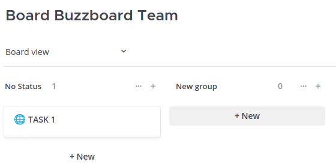 |
|  11  |  Edit the **Group** as you need. 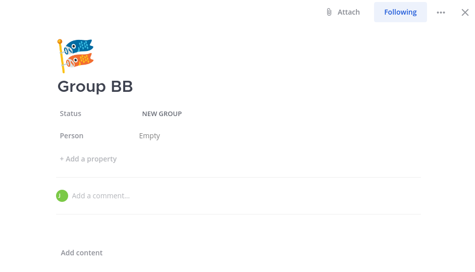  |
|  12  |  You can see the group created.  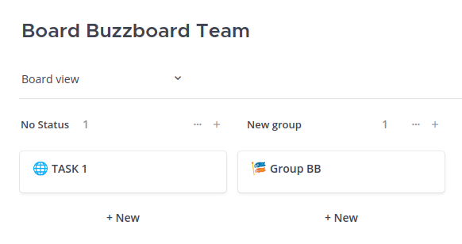  |
|  13  |          Continue editing the board as its needed.           |