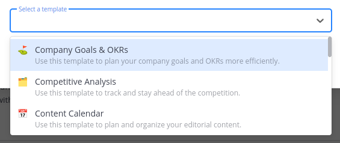

# How to Create a New Channel

| STEP |                         DESCRIPTION                          |
| :--: | :----------------------------------------------------------: |
|  1   | Go to the top left border and look for your team, then click on the **+** button, and click on the **Create New Channel** option.  |
|  2   | Type the name in the **Channel name** box.  |
|  3   | Select the type of channel you want to create. It can be **Public** or **Private**.  |
|  4   | Describe how this channel should be used or additional information in the following box  |
|  5   | You can also select the **Create a board for this channel** check mark to use a template.  |
|  6   | Select the template you desire.  |
|  7   | Click on **Create channel** to create a new one.  |
|  8   | Use the channel created.  |
| NOTE | You can select the channel created in the left side menu.  |