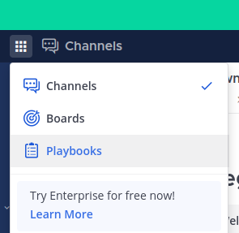
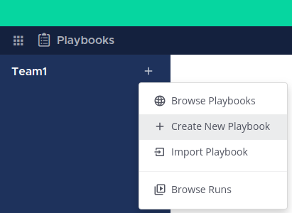
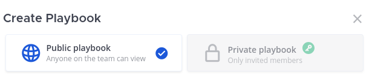
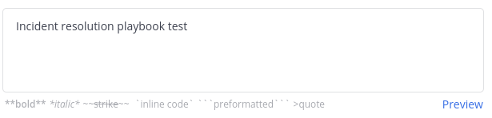

# How to Create a Playbook

| STEP |                         DESCRIPTION                          |
| :--: | :----------------------------------------------------------: |
|  1   | Go to the top left border and click on the options button, then click on the **Playbooks** option.   |
|  2   | Click on the **+** button of the desire team.  |
|  3   | Select the type of playbook you want to create. It can be **Public** or **Private**.  |
|  4   | Type the playbook name in the **Playbook name** box.   |
|  5   | Select one of the template listed or the blank option for the playbook.   |
|  6   | Describe how this playbook should be used or additional information in the following box.  |
|  7   | Click on **Create playbook** to create a new one.  |